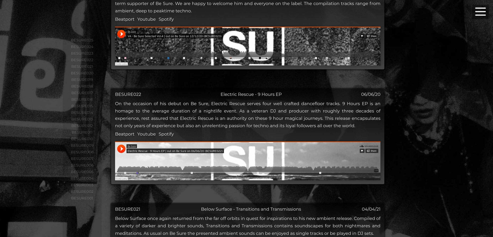
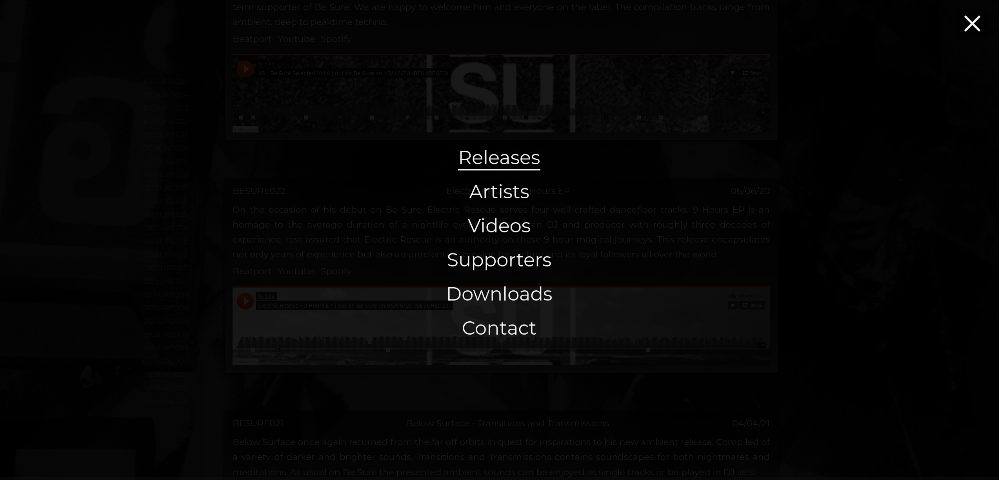
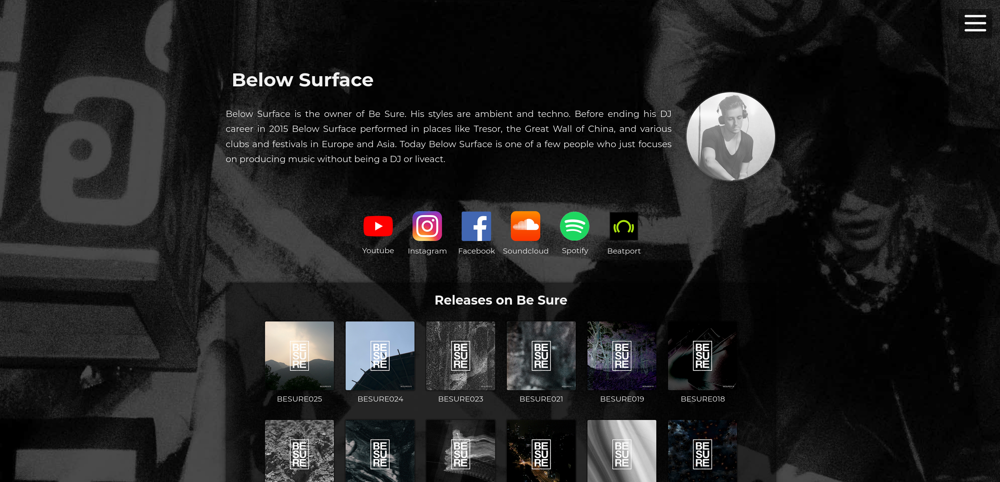
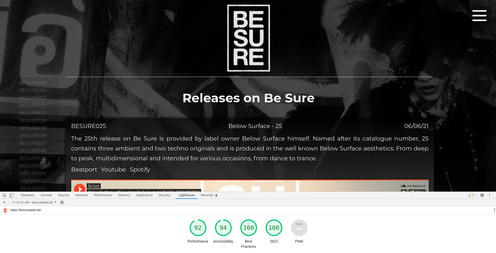

# Be Sure - Music label website
A music label website with a dark design fitting to its music style. The main goal of the page is to present the releases and provide links to online music stores and streaming services. Social media links to the artists can be found on their unique artist pages. On top, all their releases on the label are presented there aswell. The page has a contact form to get in touch with the label owner, demo tracks can be submitted here for consideration. Be Sure also produces video content, which is embedded via Youtube iframes. Hidden from the normal visitor, the page has a secret promotion section, where all the releases can be downloaded. 

Click here to enter the live website: [https://besurelabel.de](https://besurelabel.de)

## Languages
- React
- JavaScript
- HTML
- SCSS

## Libraries
- Redux, a bit overkill (to practice it) for managing state (cookie acceptance, navigation button, contact form term acceptance)
- React-Lazyload, to lazyload iframes once they appear in vision of the user
- React-Router-DOM, for the page navigation
- React-Router-Hash-Link, for the side navigation on the "Releases" page
- Emailjs, for the contact form functionality

## Note
The Impressum and Datenschutz pages are not uploaded to Github, but available on the live page.

## Screenshots
Landing page with Soundcloud iframes

Landing page with navigation opened

Artist page with social media buttons and releases

Lighthouse SEO Report
